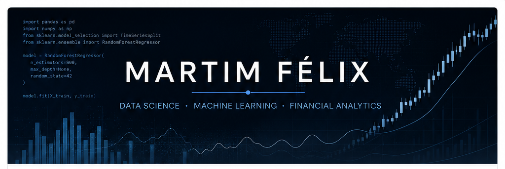

 

MSc in **Data Engineering and Data Science** at the **University of Minho**

---

## About Me

I am a Data Engineering and Data Science MSc student interested in building **reliable, data-driven systems** that go beyond model training — from data preparation and validation to optimization, APIs and decision-support applications.

My main interests lie at the intersection of **Machine Learning**, **Financial Data Science** and **Decision Support Systems**, with a particular interest in applying ML to financial risk, fraud detection and other high-impact decision problems.

### Current Focus

- **Financial Machine Learning** — fraud detection, risk analytics and data-driven financial decision-making
- **Human-AI Decision Systems** — combining machine predictions with human expertise under operational constraints
- **Predictive & Prescriptive Analytics** — connecting forecasting, optimization and decision-making
- **MLOps & ML Engineering** — reproducible pipelines, testing and production-oriented ML

---

## Currently Building

### FraudOps — Capacity-Aware Human-AI Fraud Review

**In progress**

FraudOps is a Human-AI decision-support system for fraud alert review built on the **FiFAR dataset**. The project studies when suspicious bank account applications should be resolved automatically by an ML model and when they should be **deferred to a human fraud analyst**.

The system goes beyond simple deferral by also investigating **which analyst should review each alert** and how alerts should be allocated while respecting **limited analyst capacity**.

**Core questions:**
- Can Human-AI collaboration outperform an AI-only fraud review system?
- Does intelligent analyst selection improve decision quality?
- How does limited human review capacity affect fraud detection performance and decision cost?

**Planned pipeline:**  
`Fraud Alerts → ML Model → Deferral Strategy → Analyst Routing → Capacity-Aware Allocation → Decision`

**Core methods:** Logistic Regression · LightGBM/XGBoost · Random Deferral · Uncertainty-Based Deferral · Smart Analyst Routing · Capacity-Constrained Allocation

> Advanced Learning-to-Defer methods are being considered as a stretch goal after the core FraudOps system is complete.

---

## Featured Projects

| Project | What it demonstrates |
|---|---|
| **[Predictive & Prescriptive Retail System](https://github.com/martim-q-pfelix23/predictive-prescriptive-retail-system)** | End-to-end retail decision support combining multivariate demand forecasting, metaheuristic optimization and an interactive **R Shiny** application. |
| **[Traffic Forecasting in Porto](https://github.com/martim-q-pfelix23/Traffic-Forecasting-in-Porto)** | Temporal machine learning for urban traffic congestion prediction using traffic, time and weather data, extensive feature engineering and model comparison. |
| **[Digital Wellness Analytics](https://github.com/martim-q-pfelix23/Digital-Wellness-Analytics-CRISP-DM-End-to-End-Project)** | End-to-end **CRISP-DM** data science project covering classification, regression, clustering and interactive **Power BI** analytics. |

---

## Technical Stack

**Data Science & ML:** pandas · NumPy · scikit-learn · PyTorch · forecasting · optimization · explainability  
**Engineering:** FastAPI · Docker · Git · testing · reproducible ML pipelines  
**Analytics & Applications:** R · Shiny · SQL · Power BI · Streamlit

---

## What I Value

I enjoy projects where **modelling quality and engineering quality matter equally**: clear problem formulation, leakage-aware evaluation, reproducible experiments, appropriate metrics and systems that can ultimately support real-world decisions.

---

### Let's Connect

I'm interested in **Data Science, Machine Learning and Financial Analytics** opportunities.

